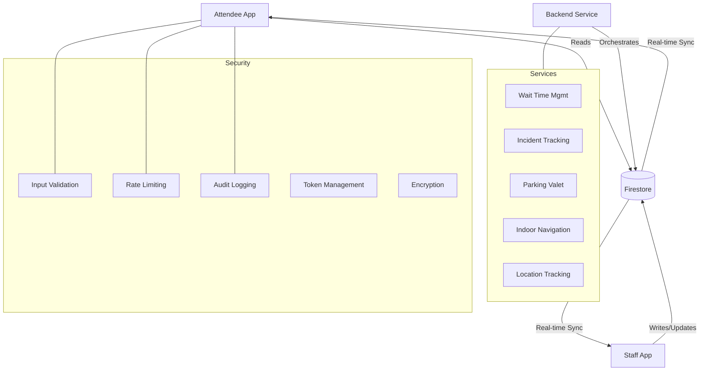

# Platform Architecture & Workflow

The Crowza Platform is designed as a twin-app high-concurrency system tailored for large-scale stadium and event management with advanced indoor navigation capabilities.

## System Architecture



## Indoor Navigation Architecture

### Components

**1. Advanced Routing Engine (`advancedRouting.ts`)**
- A* pathfinding algorithm with heuristic optimization
- Heat map integration for avoiding crowded areas
- Obstacle detection and dynamic recalculation
- Support for wheelchair accessibility
- Automatic route recalculation based on real-time conditions

**2. Indoor Navigation Service (`indoorNavigationService.ts`)**
- Real-time location tracking (GPS/BLE/WiFi trilateration)
- Route calculation and management
- Occupancy-aware navigation
- Turn-by-turn direction generation
- Nearby amenity detection
- Off-course detection and alerts

**3. Seat-Level Mapping Component (`SeatLevelMap.tsx`)**
- Individual seat visualization with occupancy status
- Accessibility information display
- Interactive seat selection
- Zoom and pan controls
- Sight line information
- Real-time location indicator

**4. Security Layer**
- Input validation for all navigation parameters
- Rate limiting on route requests
- Audit logging of navigation events
- Secure API communication with token management
- Location data encryption and privacy protection

### Data Flow

```
User Request
    ↓
Input Validation (Security)
    ↓
Rate Limit Check
    ↓
Location Tracking (Indoor Position)
    ↓
Navigation Mesh Load
    ↓
A* Routing with Heat Map
    ↓
Direction Generation
    ↓
Real-time Occupancy Sync
    ↓
Route Display
    ↓
Audit Log Event
```

## Key Workflows

### 1. Attendee Journey
1. **Authentication**: Secure login via Firebase Auth.
2. **Venue Selection**: Browse available events and venues.
3. **Indoor Exploration**: 
   - Load venue's indoor map and navigation mesh.
   - Real-time location tracking begins.
4. **Navigation**:
   - Select destination (seat, amenity, exit).
   - System calculates optimal route avoiding crowds.
   - Turn-by-turn directions provided.
5. **Arrival**: Off-course detection alerts if needed.
6. **Wayfinding Assistance**: Access to nearby amenities and facilities.
7. **Emergency**: One-tap access to security and medical services.

### 2. Staff Management
1. **Dashboard**: Unified view of venue occupancy and incidents.
2. **Operations**: 
   - Direct update of queue lengths (simulated or manual).
   - Real-time occupancy data to cloud.
3. **Incident Response**: 
   - Field staff receive alerts and navigate to GPS heat spots.
   - Real-time incident tracking and resolution.
4. **Emergency Mode**: Automatic route recalculation to prioritize exits.

### 3. Real-time Synchronization
- The system uses **Cloud Firestore listeners** for real-time updates.
- Whenever occupancy or incidents update, attendee maps refresh instantly.
- Navigation routes automatically recalculate based on changed conditions.
- Heat maps aggregate location data while preserving individual privacy.

### 4. Indoor Navigation Flow
1. **Map Initialization**:
   - Indoor mapping file loaded from backend (SVG, GeoJSON, or custom format).
   - Navigation mesh constructed with nodes, edges, and obstacles.
   - Seat map and amenity mappings created.

2. **Location Tracking**:
   - GPS used as initial positioning (when available).
   - BLE/WiFi signals for indoor trilateration (when available).
   - Fuzzy logic combines multiple signals for accuracy.

3. **Route Calculation**:
   - A* algorithm finds optimal path from current location to destination.
   - Heat map data avoids crowded zones (optional).
   - Accessibility rules enforced for wheelchair users.
   - Estimated time calculated based on distance.

4. **Navigation Display**:
   - Current position marked on map.
   - Route highlighted as colored path.
   - Next waypoint clearly indicated.
   - Turn-by-turn directions in natural language.
   - Nearby points of interest displayed.

5. **Dynamic Adaptation**:
   - Real-time location updates every 2 seconds.
   - Off-course detection alerts if user deviates >20m.
   - Automatic route recalculation if conditions change.
   - Emergency mode triggers exit highlighting.

## Security Architecture

### Input Validation Pipeline
```
User Input
    ↓
Type Check (is number, string, etc.)
    ↓
Format Validation (regex, length, bounds)
    ↓
Sanitization (XSS prevention)
    ↓
Business Logic Validation
    ↓
Approved for Processing
```

### Authentication & Token Flow
```
Login
    ↓
Firebase Auth
    ↓
Access Token Generated
    ↓
Store in Secure Storage
    ↓
Requests Include Bearer Token
    ↓
Token Expiry Check
    ↓
Automatic Refresh if Needed
    ↓
Logout → Clear Tokens
```

### Audit Logging
- All authentication events logged
- All API calls logged (success/failure)
- Location updates aggregated (privacy-preserving)
- Security incidents flagged as critical
- Reports generated automatically
- Events flushed to backend every 5 minutes or when buffer reaches 100 events

## Scalability Considerations

### Real-time Synchronization
- Firestore auto-scales to handle millions of concurrent connections.
- Listeners only subscribe to needed zones (not entire venue).
- Batch updates used for occupancy changes to reduce writes.

### Indoor Navigation
- Navigation mesh stored server-side; only loaded when needed.
- Route calculations done client-side (reduces server load).
- Heat map data aggregated (no individual tracking stored).
- Location updates batched every 2 seconds.

### Security
- Rate limiting prevents abuse (100 req/min per user).
- Input validation catches malicious requests early.
- Audit logs stored efficiently with old events pruned.
- Token-based auth reduces database queries.

## Error Handling

### Navigation Errors
- Invalid node IDs → Clear error message, return to map.
- Map load failure → Retry with exponential backoff.
- Location unavailable → Provide manual position entry.
- Route not found → Suggest nearest accessible routes.

### Security Errors
- Rate limit exceeded → HTTP 429 with retry-after.
- Invalid token → Automatic refresh or redirect to login.
- Validation failure → Return validation errors without exposing internals.
- Unauthorized access → Log critical alert, prevent action.

## Performance Metrics

### Targets
- Route calculation: <500ms (A* optimized)
- Location update: <2 seconds
- Map load: <2 seconds
- Real-time occupancy sync: <500ms
- API response time: <1 second (p95)

### Monitoring
- Client-side error tracking
- Server-side performance metrics
- Real-time alerting on threshold violations
- Audit log analysis for security events
